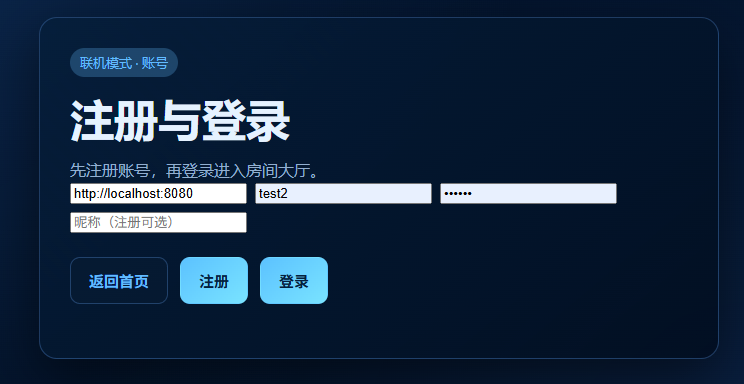
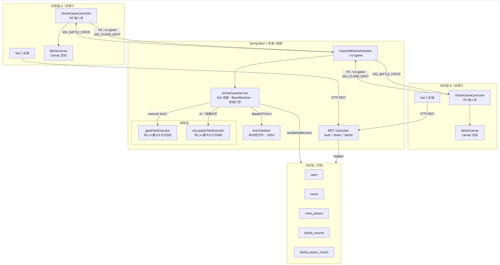
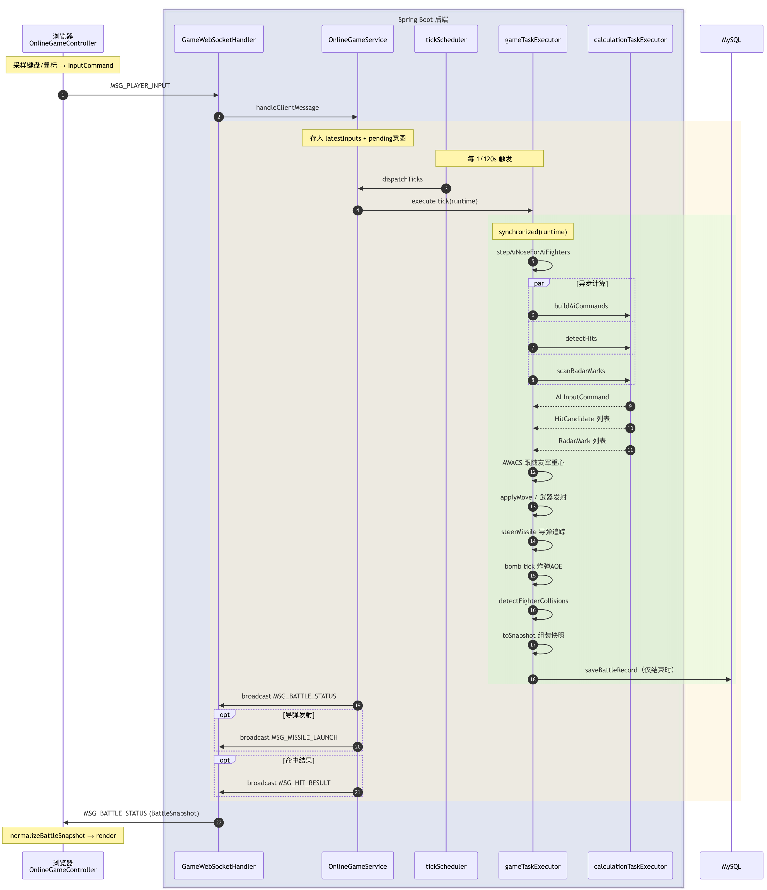
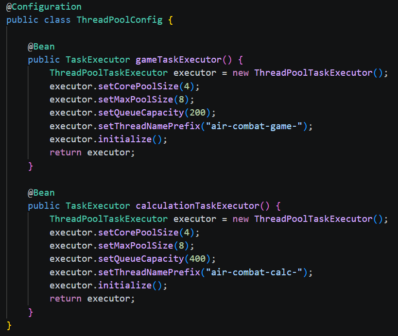
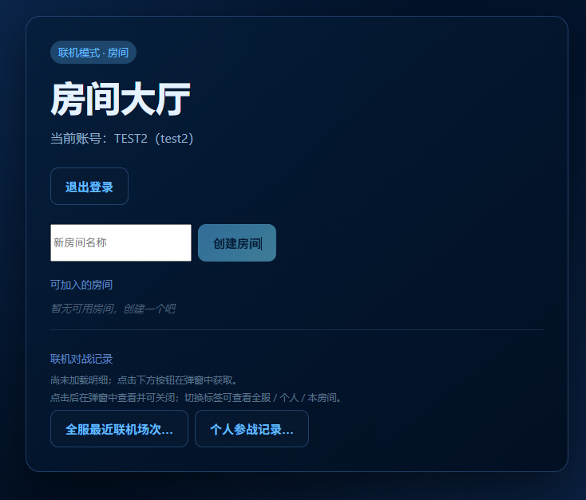
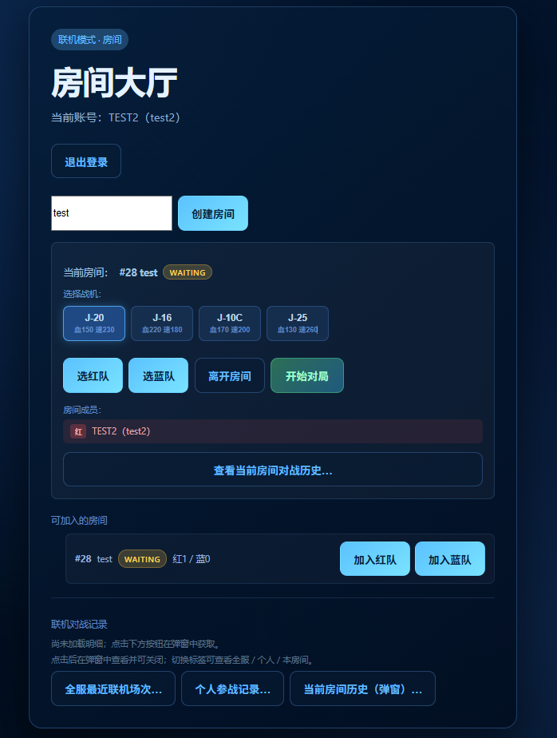
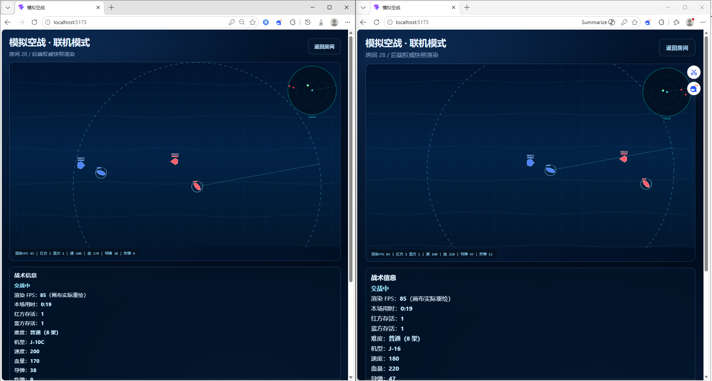
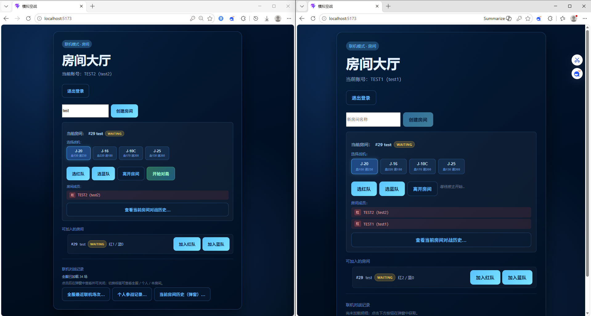
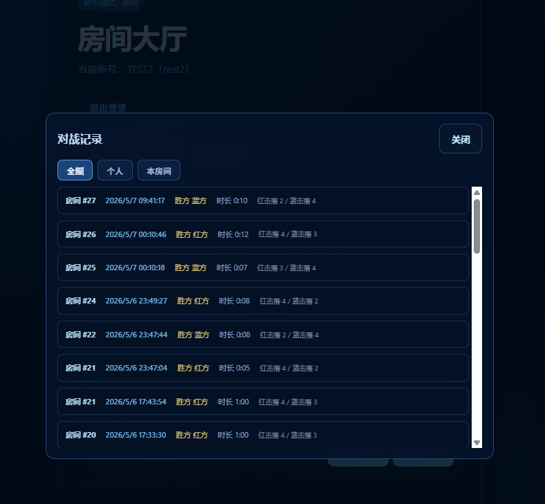
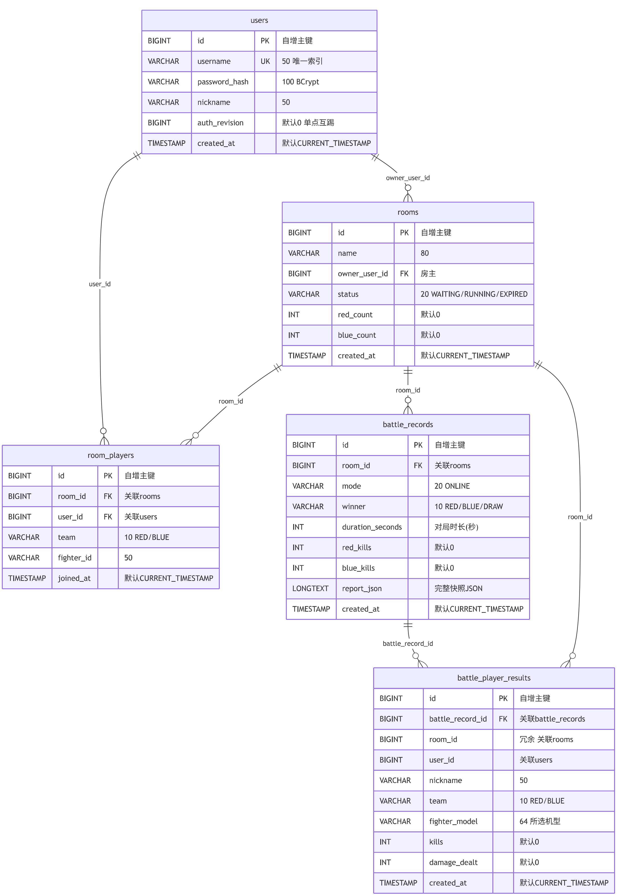

# 软件体系结构 · 模拟空战 — 实验报告（联机模式）

**课程**：软件体系结构
**作业**：模拟空战（联机版）
**姓名**：
**学号**：

---

## 摘要

**目标**：在单机模式的基础上，按 **View → Controller → Model** 分层与 **接口先行** 原则，扩展实现**可运行联机对战**：前端上行 `MSG_PLAYER_INPUT`，后端以固定 **tick-rate** 权威推进世界状态并广播 `MSG_BATTLE_STATUS`（`BattleSnapshot`），多客户端接收同一快照渲染。

**实现要点**：后端 **Spring Boot 3 + MyBatis + MySQL + WebSocket**，`OnlineGameService` 维护房间运行时（`RoomRuntime`），每 tick 完成移动、导弹追踪、炸弹 AOE、战机碰撞与胜负判定；双线程池 `gameTaskExecutor` / `calculationTaskExecutor` 分离房间推进与 AI/碰撞计算；JWT 登录态 + `auth_revision` 单点互踢；前端 `OnlineGameController` 定时上行输入、接收快照并规范化（`normalizeBattleSnapshot`），`BattleCanvas` 在联机模式下以连续 rAF 渲染。

**运行方式**：后端 `.\mvnw.cmd spring-boot:run`（需 MySQL），前端 `npm run dev`，双浏览器登录同一房间即可联机。或者后端用打包好的 JAR：`java -jar air-combat-backend-0.0.1-SNAPSHOT.jar`。

**胜负判定**：某方可计数战机全部被击落（排除 AWACS），后端判定后广播 `BATTLE_FINISHED` 并入库战报。

---

## 1 实验目的

### 1.1 实践 Client-Server 网络游戏架构

在单机分层架构基础上，将权威计算从浏览器迁移至后端：客户端仅负责输入采集与快照渲染，服务端维护战场真相。

### 1.2 掌握 WebSocket 全双工通信

上行输入指令、下行战场快照与房间事件，理解消息类型枚举（`MessageType`）与协议接口（`INetworkProtocol`）的解耦价值。

### 1.3 实践多线程并发

`gameTaskExecutor` 驱动每房间 tick、`calculationTaskExecutor` 异步计算 AI 决策与碰撞检测，理解线程池配置（核心/最大线程数、队列容量）对吞吐与延迟的影响。

### 1.4 完成账号-房间-对战-战报全链路闭环

注册登录（JWT）、房间创建/加入/选队/选机型/开始倒计时、后端权威对局、对局结束自动入库、战报查询。

---

## 2 实验环境与运行说明

### 2.1 环境要求

| 项目 | 内容 |
|------|------|
| 操作系统 | Windows / macOS / Linux |
| 浏览器 | Chrome / Edge 等主流浏览器 |
| 后端运行依赖 | Java 17+、Maven（可用 `mvnw`） |
| 数据库 | MySQL（库名 `air_combat`，见 `application.yml`） |
| 前端运行依赖 | Node.js 18+、`npm` |

### 2.2 最短复现命令

#### 2.2.1 启动后端

需先确保 MySQL 运行，库名与密码见 `application.yml`：

```powershell
cd air-combat-backend
.\mvnw.cmd spring-boot:run
```

后端默认监听 `http://localhost:8080`，健康检查：`GET /api/health`。

#### 2.2.2 启动前端

```bash
cd air-combat-frontend
npm install
npm run dev
```

浏览器打开 `http://localhost:5173`，首页登录后进入联机模式。

### 2.3 多设备联机

登录页"后端地址"填写主机局域网 IP（如 `http://192.168.x.x:8080`），即可从其他设备访问同一后端。

### 2.4 运行入口界面



**图1** 登录/注册页面（可填写后端地址）

---

## 3 需求与实现对照

### 3.1 联机核心功能

| 编号 | 需求要点 | 本实现说明 |
|------|----------|------------|
| 1 | 账号：注册、登录、JWT 鉴权；单点登录互踢 | `AuthService` + `auth_revision` 递增机制；`/api/auth/register`、`/api/auth/login`、`/api/auth/logout`；关闭标签页 `sendBeacon` 注销 |
| 2 | 房间：创建/加入/选队/离开；房主解散 | `RoomService` + `RoomController` REST；每队上限可配（`max-team-size: 4`）；房主离开自动解散并踢出全部 WebSocket |
| 3 | 同步：多客户端同房间，状态以后端为准 | WebSocket `/ws/game`；前端上行 `MSG_PLAYER_INPUT`，后端广播 `MSG_BATTLE_STATUS`（含 `BattleSnapshot`） |
| 4 | 权威：后端 tick 驱动战场、命中判定、胜负 | `OnlineGameService.tick()` 单线程串行该房间步进，AI 与碰撞异步到 `calculationTaskExecutor` |
| 5 | 断线：离线玩家战机由 AI 接管 | `controlType` 标记 PLAYER/AI；下线后 `onlineUsers` 移除，该机自动走 AI 分支 |
| 6 | 战报：对局结果入库，可查询 | `battle_records` + `battle_player_results` 两张表；`GET /api/rooms/{roomId}/battle-history` |
| 7 | 倒计时：房主开始后全员 3 秒倒计时，到点自动进战场 | `announceCountdownAndScheduleBattle` → 广播 `MATCH_COUNTDOWN` → 3s 后 `startRoom` + `BATTLE_STARTED` |
| 8 | 机型：赛前可选 J-20/J-16/J-10C/J-25 | `PUT /api/rooms/{roomId}/model`；后端 `createFighter` 使用所选机型的属性 |

### 3.2 战场规则

| 类别 | 规则 | 后端实现位置 |
|------|------|-------------|
| 战场尺寸 | 世界 3600×2160，视口 1200×720 | `OnlineGameService` 常量 `WORLD_WIDTH/HEIGHT` |
| 机型 | 4 种（J-20/J-16/J-10C/J-25），速度/HP/弹药/伤害各异 | `MODEL_STATS` Map；蓝方 AI 属性 ×0.7 |
| 导弹 | AWACS 探测区内持续追踪，区外不追踪 | `steerMissile()` + `isEnemyCoveredByFriendlyAwacs()` |
| 炸弹 | 飞行 3s 或近距碰撞触发 AOE 爆炸 | `BombRuntime.ttlMs` + `BOMB_PROXIMITY_DIST` 近炸 |
| 战机碰撞 | 两机距离 < 30px 各扣最大血量 50%，60 tick 冷却 | `detectFighterCollisions()` + `COLLISION_COOLDOWN_TICKS` |
| 预警机 | 双方各 1 架 KJ-500，跟随存活友机重心；雷达仅 AWACS 提供 | `isAwacs` 标记 + `awacsEffectiveRadarRange()` |
| 胜负 | 排除 AWACS，某方战机全灭 → 对方胜；同时全灭 → 平局 | `toSnapshot()` 内 `redAlive/blueAlive` 统计 |

### 3.3 架构与接口约束

| 编号 | 约束或要求 | 本实现说明 |
|------|-----------|------------|
| A | 分层：前后端均保持 View/Controller/Model；Model 不依赖 UI/通信 | 前端 `OnlineGameController` 居中协调、`OnlineGameView` 仅读快照渲染；后端 `OnlineGameService` 模型层、`GameWebSocketHandler` 视图层 |
| B | 接口：`IFighter`、`IMissile`、`IRadarSystem`、`ICombatJudger`、`IAIController`、`INetworkProtocol` | 后端定义在 `com.aircombat.game` 包中；前端定义在 `interfaces.ts`；前后端各独立实现，类型对齐 |
| C | 网络：后端权威计算，前端只渲染快照；预留 `INetworkProtocol` | 见「接口先行与协议设计」与「网络对战详细实现」 |
| D | 持久化：MyBatis 作为 ORM 框架连接 MySQL | 后端通过 Mapper 接口 + XML 映射完成 CRUD，`application.yml` 配置 MyBatis 驼峰转换 |

---

## 4 系统架构

### 4.1 整体部署架构



**图2** 联机模式整体架构（浏览器 - REST/WebSocket - Spring Boot - MySQL）

### 4.2 分层结构

| 端 | 分层与职责 | 代表文件 |
|----|-----------|----------|
| 浏览器 | View：页面布局、画布、HUD、登录/房间 UI | `OnlineGameView.vue`、`BattleCanvas.vue`、`LoginView.vue`、`RoomView.vue` |
| 浏览器 | Controller：WebSocket 输入泵、快照规范化与派发 | `OnlineGameController.ts`、`InputController.ts`、`normalizeBattleSnapshot.ts` |
| 浏览器 | Model：接口类型、协议实现（联机不跑战场） | `interfaces.ts`、`types.ts`、`JsonNetworkProtocol.ts` |
| Spring | View/Display：REST 控制器、WebSocket Handler | `AuthController.java`、`RoomController.java`、`GameWebSocketHandler.java` |
| Spring | Service：业务编排、tick 调度、房间生命周期 | `OnlineGameService.java`、`RoomService.java`、`AuthService.java` |
| Spring | Model/Domain：实体、MyBatis Mapper、运行时内部类 | `Room.java`、`FighterState.java`、`BattleSnapshot.java`、`InputCommand.java`、`RoomMapper.java` 等 |

### 4.3 数据流



**图3** 联机数据流示意

---

## 5 接口先行与协议设计

### 5.1 六大接口

核心接口在前端 `interfaces.ts` 与后端 `com.aircombat.game` 包中各自定义，实现类通过 `implements` 关联。

| 接口 | 责任概述 | 后端对应文件 |
|------|----------|-------------|
| `IFighter` | 战机移动、武器发射、伤害、状态导出 | `IFighter.java`（FighterState record 承载状态） |
| `IMissile` | 导弹发射、追踪、失效、状态导出 | `IMissile.java`（MissileState record） |
| `IRadarSystem` | AWACS 扫描、探测目标列表 | `IRadarSystem.java`（`scanRadarMarks()`） |
| `ICombatJudger` | 碰撞判定、战果统计 | `ICombatJudger.java`（`detectHits()`） |
| `IAIController` | AI 决策生成 `AICommand` | `IAIController.java`（`buildAiCommands()`） |
| `INetworkProtocol` | 消息序列化/反序列化 | `INetworkProtocol.java`、`JsonNetworkProtocol.java` |

### 5.2 网络协议设计

#### 5.2.1 序列化选型

JSON 文本帧。`JsonNetworkProtocol` 实现 `INetworkProtocol.serialize()/deserialize()`。选择 JSON 的理由：可读易调试、与浏览器 `WebSocket` 文本帧天然兼容；若需带宽优化可替换为二进制协议而不影响接口契约。

#### 5.2.2 核心消息类型

`MessageType` 枚举共 7 种：

| 类型 | 方向与含义 |
|------|-----------|
| `MSG_PLAYER_INPUT` | 上行：玩家键盘/鼠标输入（`InputCommand`） |
| `MSG_BATTLE_STATUS` | 下行：每 tick 广播战场全量快照（`BattleSnapshot`） |
| `MSG_MISSILE_LAUNCH` | 下行：导弹发射事件（批量） |
| `MSG_HIT_RESULT` | 下行：命中结果事件（批量） |
| `MSG_ROOM_EVENT` | 下行：房间事件（`PLAYER_ONLINE/OFFLINE`、`MATCH_COUNTDOWN`、`BATTLE_STARTED`、`BATTLE_FINISHED`、`ROOM_EXPIRED`） |
| `MSG_ERROR` | 下行：服务端错误通知 |

#### 5.2.3 通用消息信封

`NetworkMessage<T>` 结构：

| 字段 | 类型 | 说明 |
|------|------|------|
| `type` | `MessageType` | 消息类型 |
| `roomId` | `Long` | 所属房间 |
| `senderId` | `String` | 发送者（可为 null） |
| `tick` | `Long` | 服务器 tick 序号 |
| `timestamp` | `Long` | 服务器时间戳（ms） |
| `payload` | `T` | 消息体（类型由 `type` 决定） |

### 5.3 REST API

请求头：`X-Token: <JWT>`（注册/登录除外）。

#### 5.3.1 认证接口

| 方法 | 路径 | 说明 |
|------|------|------|
| `POST` | `/api/auth/register` | 注册 |
| `POST` | `/api/auth/login` | 登录，返回 JWT |
| `POST` | `/api/auth/logout` | 注销，递增 `auth_revision` 使旧 token 失效 |
| `POST` | `/api/auth/logout-beacon` | 关闭页签时 `sendBeacon` 尽力注销 |

#### 5.3.2 房间接口

| 方法 | 路径 | 说明 |
|------|------|------|
| `POST` | `/api/rooms` | 创建房间 |
| `GET` | `/api/rooms` | 房间列表（仅 WAITING / RUNNING） |
| `GET` | `/api/rooms/{id}` | 房间详情（含玩家列表） |
| `POST` | `/api/rooms/{id}/join` | 加入房间（指定 RED/BLUE） |
| `POST` | `/api/rooms/{id}/team` | 切换队伍 |
| `POST` | `/api/rooms/{id}/leave` | 离开（房主离开解散房间） |
| `POST` | `/api/rooms/{id}/start` | 房主开始（触发 3s 倒计时） |
| `PUT` | `/api/rooms/{id}/model` | 选择机型 |

#### 5.3.3 战报接口

| 方法 | 路径 | 说明 |
|------|------|------|
| `GET` | `/api/rooms/{id}/battle-history` | 房间对战历史 |
| `GET` | `/api/battles/my-history` | 个人对战历史 |

---

## 6 性能优化分析

### 6.1 后端并发模型

后端采用"单线程 tick 调度 + 双线程池执行"的三层模型：

| 组件 | 配置 | 职责 |
|------|------|------|
| `tickScheduler` | 单线程 `ScheduledExecutorService`，守护线程 | 按 `tick-rate`（默认 120）定时触发 `dispatchTicks()`，遍历所有 RUNNING 房间投递 tick 任务 |
| `gameTaskExecutor` | 核心 4 / 最大 8 / 队列 200 | 执行每个房间的 `tick()`；`synchronized(runtime)` 保证同一房间串行 |
| `calculationTaskExecutor` | 核心 4 / 最大 8 / 队列 400 | `CompletableFuture.supplyAsync` 异步执行 AI 决策与碰撞检测 |



**图4** 线程池配置代码（ThreadPoolConfig.java）

#### 6.1.1 tick 调度单线程化

`tickScheduler` 只负责到点把任务扔进 `gameTaskExecutor`，自身不做重量计算，避免调度延迟堆积。

#### 6.1.2 同房间串行

`tick(RoomRuntime)` 内 `synchronized(runtime)` 保证同一房间的状态修改线性化，避免并发写竞态。

#### 6.1.3 计算分离

AI 决策和碰撞检测通过 `calculationTaskExecutor` 异步执行，`CompletableFuture.join()` 在 tick 内收敛结果；若计算线程池饱和，队列缓冲 400 个任务。

#### 6.1.4 InputCommand pending 意图

高频率输入下 `latestInputs` 可能被覆盖导致 `fire` 丢失；引入 `pendingMissileByFighter` / `pendingBombByFighter` 在 tick 消费时合并，确保按钮按下不被漏掉。

### 6.2 前端渲染优化

| 优化领域 | 常见手段 | 本实现 |
|----------|----------|--------|
| 快照渲染 | 仅重绘变更帧、去重 | 联机模式下 `BattleCanvas` 开启 `continuousRafRender`（快照间歇仍按显示刷新重绘），上限 120 FPS（`MIN_RENDER_INTERVAL_MS`） |
| 数据规范化 | 后端平铺 x/y Map → 前端 `position` 结构 | `normalizeBattleSnapshot.ts` 将 `damagePopups` 转为带 `position` 的对象，避免画布渲染崩溃 |
| 离屏缓冲 | 双缓冲、脏矩形 | 复用单机的 `GameRenderer`：`worldBuffer` / `minimapBuffer` 离屏 Canvas |
| 碰撞检测 | 后端空间距离计算 | 后端 `detectHits()` 对每枚存活的导弹找最近敌方战机 |

### 6.3 线程池与任务书对应

单机模式（`LocalGameController`）以 `requestAnimationFrame` 主线程驱动，线程池概念体现在后端联机：`gameTaskExecutor` 类比"游戏主循环线程池"，`calculationTaskExecutor` 类比"计算线程池"。二者配合实现了"计算与调度分离"——tick 调度器只管节拍，计算线程池处理 CPU 密集型子任务，避免了游戏主循环被 AI/碰撞计算阻塞。

---

## 7 网络对战详细实现

### 7.1 WebSocket 连接建立

连接地址：

```
ws://localhost:8080/ws/game?token=<JWT>&roomId=<数字>
```

#### 7.1.1 连接流程

`GameWebSocketHandler.afterConnectionEstablished()` 中完成：

1. 从查询参数解析 `token` 与 `roomId`
2. 调用 `OnlineGameService.connect()`：
   - 校验 JWT → 获取 `SessionUser`
   - 校验 `auth_revision`（防止旧 token 重用）
   - 校验房间存在且玩家在房内
   - 注册 `ConnectionContext`、按 `(roomId, userId)` 去重（新连接替换旧连接，旧连接收到 `4000 SESSION_REPLACED`）
   - 发送当前快照（`sendCurrentSnapshot`）
3. 广播 `PLAYER_ONLINE` 房间事件

#### 7.1.2 连接关闭码

| 码 | 含义 |
|----|------|
| `4000` | `SESSION_REPLACED` — 新 WebSocket 替换了旧连接 |
| `4001` | `AUTH_REVOKED` — `auth_revision` 已变更（被新登录踢下线） |

### 7.2 消息处理

#### 7.2.1 输入写入

`handleClientMessage()` → 反序列化 → 仅接受 `MSG_PLAYER_INPUT` → 提取 `InputCommand` → 写入 `runtime.latestInputs[fighterId]`。如果 `fire=true` 或 `fireBomb=true`，同时写入 `pendingMissileByFighter` / `pendingBombByFighter`，防止下一帧输入覆盖导致开火丢失。

#### 7.2.2 auth_revision 节流校验

每 20 条输入或每 2s 检查一次 `auth_revision` 是否被新登录递增（`sessionReauthStillValid`）。若已变更，关闭 WebSocket（`4001 AUTH_REVOKED`），实现单点登录互踢。

### 7.3 Tick 循环

`OnlineGameService.tick()` 每 tick 执行以下 11 步（`synchronized(runtime)`）：

#### 7.3.1 AI 机头朝向

`stepAiNoseForAiFighters`：离线玩家的战机维持玩家最后的朝向；纯 AI 战机逐渐转向最近敌机。

#### 7.3.2 AI 决策

`buildAiCommands`：通过 `calculationTaskExecutor` 异步生成所有 AI 战机的 `InputCommand`。AI 会计算到最近敌机的导航角、以一定侧向偏移逼近、在距离 < 260 且机头对准时概率发射导弹，距离 < 200 时概率投弹。

#### 7.3.3 AWACS 移动

双方 KJ-500 跟随己方存活友机重心移动，距离重心 > 80px 时以固定速度靠近，保持在战场边缘附近。

#### 7.3.4 移动执行

`applyMove`：根据 `InputCommand` 的 `moveX/moveY` 更新战机位置与朝向，边界 clamp 在 50~3550 / 50~2110。

#### 7.3.5 武器发射

处理 `fire`/`fireBomb` 与 pending 意图，创建 `MissileRuntime`/`BombRuntime`。导弹若指定了 `targetId` 则锁定目标（需目标存活且敌方），否则自动选最近敌机。若目标在己方 AWACS 探测区内则激活追踪。

#### 7.3.6 导弹步进

`steerMissile`：若 `homingActive` 为 true（目标在 AWACS 覆盖下），持续转向目标（角速度上限 `MISSILE_MAX_TURN_RAD_PER_SEC = pi × 2.8`），否则直飞。TTL 3.5s，出界则失效。

#### 7.3.7 炸弹步进

匀速飞行，TTL 3s 到期或近距碰撞（`BOMB_PROXIMITY_DIST = 30`）触发 AOE 爆炸：对爆炸半径内所有敌方战机造成 `blastDamage` 伤害，并产生伤害飘字。

#### 7.3.8 碰撞检测

分两步并行异步到 `calculationTaskExecutor`：

1. **导弹命中**（`detectHits`）：每枚存活导弹找最近敌方战机，距离 <= 22 判命中，扣血并销毁导弹
2. **战机互撞**（`detectFighterCollisions`）：红蓝双方及同队两两检测，距离 < 30px 各扣 `maxHp × 50%`，同一对战对 60 tick 冷却

#### 7.3.9 雷达扫描

`scanRadarMarks`：仅 AWACS 单元贡献探测，范围随 HP 线性缩放（最大 900）。每个敌方目标只被首个覆盖它的 AWACS 标记一次。

#### 7.3.10 快照组装与广播

`toSnapshot` 将 `fighters`、`missiles`（存活的）、`bombs`（存活的）、`radarMarks`、`damagePopups`、`redAlive`、`blueAlive` 组装为 `BattleSnapshot` record，通过 `broadcast` 以 `MSG_BATTLE_STATUS` 下发。

#### 7.3.11 胜负判定与战报入库

若某方可计数战机（排除 AWACS）全灭 → 状态置为 `RED_WIN` / `BLUE_WIN`；双方同时全灭 → `DRAW`。广播 `BATTLE_FINISHED` 事件（含战报 ID、胜负方、时长、击杀数、玩家明细），调用 `saveBattleRecord` 写入 `battle_records` 与 `battle_player_results` 两张表。

---

## 8 运行演示截图


**图5** 登录页面（含后端地址配置）



**图6** 房间大厅（房间列表 + 自动轮询刷新）



**图7** 房间内（选队、选机型、等待开始）



**图8** 联机战斗界面（双窗口同步，昵称显示，双方 AWACS）



**图9** 联机双浏览器同房间对战



**图10** 对战历史与战报查询



**图11** 数据库表结构（ER 图，5 张表）

---

## 9 实验总结

### 9.1 完成情况

本实验在单机分层架构的基础上，扩展实现了完整的联机对战闭环：

- **账号体系**：注册、登录、JWT 鉴权、`auth_revision` 单点互踢、标签页关闭 `sendBeacon` 注销
- **房间系统**：创建/加入/选队/选机型/离开/房主解散，房间状态流转（WAITING → RUNNING → WAITING/EXPIRED），超时房间自动过期
- **实时对战**：WebSocket 全双工通信，后端 120 tick/s 权威推进，前端接收 `BattleSnapshot` 渲染
- **AI 接管**：玩家离线后其战机自动切换为 AI 控制，保证对局不中断
- **战报持久化**：对局结果（胜负、击杀、伤害、玩家明细）自动入库，支持房间/个人历史查询
- **前后端接口对齐**：`InputCommand` 字段（`moveX/Y`、`fire`、`fireBomb`、`fireHeading`、`fireBombHeading`）前后端一致；`BattleSnapshot` 含 `fighters`、`missiles`、`bombs`、`radarMarks`、`damagePopups`

在接口先行方面，六大接口在前端 `interfaces.ts` 和后端 `com.aircombat.game` 包中各自定义并实现；`INetworkProtocol` + `JsonNetworkProtocol` + `MessageType` 构成了完整的消息协议层。

### 9.2 性能与并发体会

后端采用"单线程 tick 调度 + 双线程池执行"的模型：`tickScheduler`（单线程守护）负责按 120Hz 节拍投递任务，`gameTaskExecutor`（4~8 线程）并行执行多房间 tick，`calculationTaskExecutor`（4~8 线程）异步处理 AI 决策与碰撞计算。通过 `synchronized(runtime)` 保证同一房间状态修改的线性化，避免了细粒度锁的复杂度。

"计算与调度分离"是游戏服务器性能的核心——tick 调度器对延迟敏感，必须轻量且准时；而 AI 与碰撞计算属于 CPU 密集型，应异步到独立线程池，通过 `CompletableFuture` 在 tick 内收敛结果。队列容量的设置（game: 200, calc: 400）是在背压（防止 OOM）与吞吐之间的权衡。

前端联机渲染方面：`continuousRafRender` 模式在快照未到达时仍按显示器刷新率重绘最后一帧（上限 120 FPS），避免了快照频率低于刷新率时的画面卡顿感；`normalizeBattleSnapshot` 将后端平铺的 `damagePopups` Map 转为带 `position` 的结构，是前后端数据契约对齐的典型工程实践。

### 9.3 小结

本次联机实验在单机 MVC 分层与接口抽象的基础上，将权威计算迁移到后端 Spring Boot + WebSocket 架构，完成了从"浏览器本地推演"到"后端权威多客户端同步"的架构跃迁。通过线程池设计、消息协议规范化、前后端类型对齐和 pending 意图模式等工程手段，保证了联机对战的正确性与可演示性。整个过程加深了对网络游戏同步、并发调度、协议解耦和前后端协作的理解。

---

## 变更记录

| 日期 | 变更内容 |
|------|----------|
| 2026-05-30 | 初稿：完成联机模式报告框架，包含需求对照、架构分层、接口协议、性能分析、运行截图占位 |
| 2026-06-02 | 定稿：补充 WebSocket 详细实现、完善线程池分析、对齐代码实际实现 |

## AI 辅助开发说明（诚信声明）

本项目源代码与文档的初稿主要借助 Cursor IDE 中的 GPT 类大模型辅助生成。本人独立完成的工作包括：整体与分层架构设计、模块边界与接口约定；结合课程任务书对功能与文字的修改与取舍；以及在本地环境中的调试、验收与核对（含后端 MySQL 建库、前后端联调、WebSocket 通信验证与多浏览器联机测试）。

本人已理解并可说明关键模块的职责与交互（例如 `OnlineGameService.tick()` 的步进序列、`GameWebSocketHandler` 的连接管理、前端 `OnlineGameController` 的输入泵与快照规范化、线程池的调度拓扑）。
