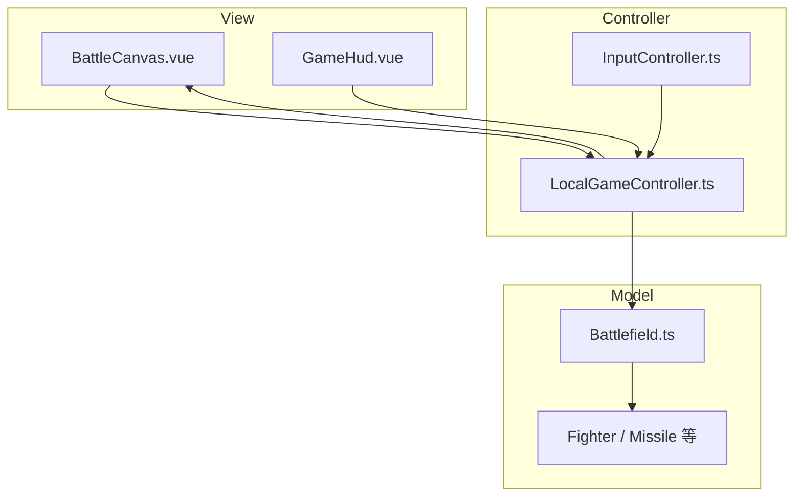
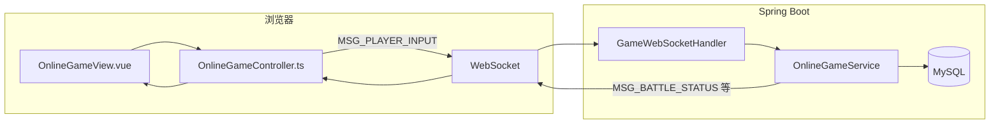

# 模拟空战 · 答辩手册（技术栈与架构）

> 辅助课堂答辩：**技术栈**、**分层与数据流**、**任务书评分对照**、**常见问题**。与仓库实现一致；任务书未要求实装联机时，本仓库已在 `INetworkProtocol` 预留基础上 **实现了可运行联机**。

## 0. 文档与仓库导航

| 资源 | 链接 |
|------|------|
| **核心文件索引（可点击打开源码）** | [§5 核心文件索引](#section-5-file-index) |
| 文档总索引 | [docs/README.md](README.md) |
| 根目录启动说明 | [README.md](../README.md) |
| 任务书 PDF | [作业1-模拟空战_作业任务书.pdf](../作业1-模拟空战_作业任务书.pdf) |
| 单机实验报告 | [reports/实验报告_单机模式.md](reports/实验报告_单机模式.md) |
| 联机实验报告 | [reports/实验报告_联机模式.md](reports/实验报告_联机模式.md) |
| 数据库疑难 | [数据库与房间疑难.md](数据库与房间疑难.md) |
| 前端性能补充 | [../air-combat-frontend/src/README.md](../air-combat-frontend/src/README.md) |

以下 **行号** 以当前仓库为准；若你本地增删过代码，以 IDE 为准稍作平移。

---

## 1. 一分钟陈述

本项目是《软件体系结构》课程「模拟空战」：顶视海空战场，红方玩家机 + 空警-500 预警机，蓝方多架 AI 敌机。采用 **Vue3 + TypeScript** 前端与 **Spring Boot 3 + MyBatis + MySQL** 后端。**单机模式**在浏览器内完成推演与渲染；**联机模式**由 **后端固定 tick** 权威计算，前端经 **WebSocket** 发送输入、接收 `BattleSnapshot` 渲染。界面实时 **FPS**，并落实 **接口先行**、**空间划分/对象池/双缓冲** 等性能相关设计。

---

## 2. 技术栈一览

| 分层 | 技术 | 作用 |
|------|------|------|
| 前端 UI | Vue 3、Vite | 路由与视图装配 |
| 前端逻辑 | TypeScript | 控制器、协议类型、`BattleSnapshot` |
| 渲染 | Canvas 2D、`GameRenderer` | 离屏缓冲、脏矩形、Path2D |
| 后端服务 | Spring Boot 3 | REST（账号/房间）、WebSocket |
| 持久化 | MyBatis、MySQL | 用户、房间、对战记录 |
| 实时联机 | Spring WebSocket、`OnlineGameService` | 权威 tick、广播快照 |

---

## 3. 单机数据流（分层）



- **View** 只消费快照与输入绑定，不直接 `new` 战场逻辑对象。  
- **Controller** 持有 `requestAnimationFrame` 循环、聚合输入、驱动 `Battlefield` 步进并下发渲染快照。  
- **Model** 无 Vue/DOM/WebSocket 依赖。

---

## 4. 联机数据流（前后端分工）



- **原则**：命中、胜负、AI 补位、导弹运动以 **服务端** 为准；前端 **只做呈现与输入采样**。

---

## Section 5 file index

**§5 · 核心文件索引（点击文件名打开源码）**  

下列路径均为相对 **本文件所在目录**（`docs/`）的 Markdown 链接；在编辑器或 GitHub 中点击可在对应环境中打开源码文件。需要行号说明时继续阅读 **第 6 节**。

| 职责 | 源码文件 |
|------|----------|
| 六大接口 + `GameController`（TS） | [interfaces.ts](../air-combat-frontend/src/game/interfaces.ts) |
| 六大接口（Java，示例入口） | [IFighter.java](../air-combat-backend/src/main/java/com/aircombat/game/IFighter.java) |
| 单机主循环 | [LocalGameController.ts](../air-combat-frontend/src/controllers/LocalGameController.ts) |
| 联机输入泵 + WebSocket 客户端 | [OnlineGameController.ts](../air-combat-frontend/src/controllers/OnlineGameController.ts) |
| 键鼠 + 画布坐标映射 | [InputController.ts](../air-combat-frontend/src/controllers/InputController.ts) |
| 鼠标→世界射向 | [augmentInputFireHeading.ts](../air-combat-frontend/src/controllers/augmentInputFireHeading.ts) |
| 战场与对象池 | [Battlefield.ts](../air-combat-frontend/src/game/Battlefield.ts) |
| 碰撞网格粗筛 | [CombatJudger.ts](../air-combat-frontend/src/game/CombatJudger.ts) |
| 对象池泛型 | [objectPool.ts](../air-combat-frontend/src/game/objectPool.ts) |
| 渲染 | [GameRenderer.ts](../air-combat-frontend/src/rendering/GameRenderer.ts) |
| FPS 与节流常量 | [fpsCounter.ts](../air-combat-frontend/src/rendering/fpsCounter.ts) |
| 联机输入周期 | [onlineGameConfig.ts](../air-combat-frontend/src/shared/onlineGameConfig.ts) |
| 消息类型（TS） | [types.ts](../air-combat-frontend/src/game/types.ts) |
| JSON 协议（前） | [JsonNetworkProtocol.ts](../air-combat-frontend/src/game/JsonNetworkProtocol.ts) |
| JSON 协议（后） | [JsonNetworkProtocol.java](../air-combat-backend/src/main/java/com/aircombat/game/JsonNetworkProtocol.java) |
| 消息类型（Java） | [MessageType.java](../air-combat-backend/src/main/java/com/aircombat/game/MessageType.java) |
| 上行载荷 | [InputCommand.java](../air-combat-backend/src/main/java/com/aircombat/game/InputCommand.java) |
| WebSocket 注册 | [WebSocketConfig.java](../air-combat-backend/src/main/java/com/aircombat/config/WebSocketConfig.java) |
| WS 帧入口 | [GameWebSocketHandler.java](../air-combat-backend/src/main/java/com/aircombat/display/GameWebSocketHandler.java) |
| 联机 tick / 广播 | [OnlineGameService.java](../air-combat-backend/src/main/java/com/aircombat/service/OnlineGameService.java) |
| REST 登录注册 | [AuthController.java](../air-combat-backend/src/main/java/com/aircombat/controller/AuthController.java) |
| REST 房间 | [RoomController.java](../air-combat-backend/src/main/java/com/aircombat/controller/RoomController.java) |
| 线程池 Bean | [ThreadPoolConfig.java](../air-combat-backend/src/main/java/com/aircombat/config/ThreadPoolConfig.java) |
| Tick 与 JWT | [application.yml](../air-combat-backend/src/main/resources/application.yml) |

---

## 6. 关键代码导读（答辩可指给评委看）

> 行号为文件内 **1-based** 约界；Opening 时可在 IDE 用「转至行」定位。

### 6.1 单机：`requestAnimationFrame` 主循环

| 行号（约） | 文件 | 内容 |
|------------|------|------|
| 95–125 | [`LocalGameController.ts`](../air-combat-frontend/src/controllers/LocalGameController.ts) | `loop`：`deltaSeconds`、`consume` 输入、`augmentInputWithWorldFireAngles`、`battlefield.update`、`getSnapshot`、`requestAnimationFrame` 递归 |
| 41–49 | 同上 | `start()`：`reset`、首帧 `loop(0)` |

### 6.2 键鼠与画布像素对齐（联机 / 单机共用）

| 行号（约） | 文件 | 内容 |
|------------|------|------|
| 40–56 | [`InputController.ts`](../air-combat-frontend/src/controllers/InputController.ts) | `syncMouseFromEvent`：`clientX/Y` → 按 `canvas.width/height` 与 `getBoundingClientRect()` 换算内部像素 |
| 107–115 | 同上 | `consume()`：输出 `InputCommand`（`fire` / `fireBomb`、键鼠意图） |

### 6.3 单机：对象池与战场更新

| 行号（约） | 文件 | 内容 |
|------------|------|------|
| 48–49 | [`Battlefield.ts`](../air-combat-frontend/src/game/Battlefield.ts) | `missilePool` / `bombPool` 容量与 `ObjectPool` |
| 412、442 | 同上 | `acquire` 导弹/炸弹 |
| 6–80 | [`CombatJudger.ts`](../air-combat-frontend/src/game/CombatJudger.ts) | `gridSize`、按格建 `Map`、`getNearbyFighters` 粗筛候选 |

### 6.4 联机：前端输入泵与协议

| 行号（约） | 文件 | 内容 |
|------------|------|------|
| 1–3 | [`onlineGameConfig.ts`](../air-combat-frontend/src/shared/onlineGameConfig.ts) | `ONLINE_TICK_RATE`、`ONLINE_INPUT_PUMP_MS` |
| 121–154 | [`OnlineGameController.ts`](../air-combat-frontend/src/controllers/OnlineGameController.ts) | `onmessage`：`MSG_BATTLE_STATUS` → `normalizeBattleSnapshot`、`presentOnlineBattleSnapshot`、`flushNotify` |
| 157–181 | 同上 | `startInputPump`：`setInterval` 组装 `MSG_PLAYER_INPUT` 并 `serialize` 发送 |

### 6.5 联机：WebSocket 接入

| 行号（约） | 文件 | 内容 |
|------------|------|------|
| 20–24 | [`WebSocketConfig.java`](../air-combat-backend/src/main/java/com/aircombat/config/WebSocketConfig.java) | 注册 `/ws/game`、`setAllowedOriginPatterns` |
| 27–36 | [`GameWebSocketHandler.java`](../air-combat-backend/src/main/java/com/aircombat/display/GameWebSocketHandler.java) | 建连 → `connect`；文本帧 → `handleClientMessage` |

### 6.6 联机：服务端 tick、线程池、pending 开火

| 行号（约） | 文件 | 内容 |
|------------|------|------|
| 167–170 | [`OnlineGameService.java`](../air-combat-backend/src/main/java/com/aircombat/service/OnlineGameService.java) | `startSchedulers`：`tickScheduler.scheduleAtFixedRate(dispatchTicks, …)` |
| 249–283 | 同上 | `handleClientMessage`：`latestInputs.put`；`RUNNING` 时写入 `pendingMissileByFighter` / `pendingBombByFighter` |
| 341–347 | 同上 | `dispatchTicks`：每房间 `gameTaskExecutor.execute(() -> tick(runtime))` |
| 414–430 | 同上 | `pendingMissile` 与 `command.fire()` 合并后 `createMissile`；炸弹分支紧随其后 |
| 11–30 | [`ThreadPoolConfig.java`](../air-combat-backend/src/main/java/com/aircombat/config/ThreadPoolConfig.java) | `gameTaskExecutor` / `calculationTaskExecutor` 池大小与线程名前缀 |
| 21–24 | [`application.yml`](../air-combat-backend/src/main/resources/application.yml) | `air-combat.game.tick-rate`、`max-team-size` |

### 6.7 接口与消息类型

| 行号（约） | 文件 | 内容 |
|------------|------|------|
| 17–55 | [`interfaces.ts`](../air-combat-frontend/src/game/interfaces.ts) | `IFighter` … `INetworkProtocol` |
| 8–15 | [`types.ts`](../air-combat-frontend/src/game/types.ts) | `MessageType` 联合类型 |
| 3–10 | [`MessageType.java`](../air-combat-backend/src/main/java/com/aircombat/game/MessageType.java) | 与前端对齐的枚举 |
| 3–11 | [`InputCommand.java`](../air-combat-backend/src/main/java/com/aircombat/game/InputCommand.java) | 上行 record：`moveX/Y`、`fire`、`fireHeading` 等 |

---

## 7. 接口清单（任务书 5.2）

| 接口 | 职责（简述） |
|------|----------------|
| `IFighter` | 战机移动、射击、承伤、状态 |
| `IMissile` | 发射、追踪、引爆、更新 |
| `IRadarSystem` | 扫描、探测范围、目标列表 |
| `ICombatJudger` | 碰撞、命中、战场状态 |
| `IAIController` | AI 决策与执行、难度 |
| `INetworkProtocol` | 消息序列化/反序列化/类型识别 |

---

## 8. 任务书评分项对照（证据链）

| 权重 | 评分要点 | 本项目对应 |
|------|-----------|------------|
| 30% | 分层、依赖方向 | View → Controller → Model；后端 display / service / game 分包 |
| 20% | FPS、线程池、空间索引等 | FPS：`fpsCounter` + 画布；线程池：`ThreadPoolConfig`；网格：`CombatJudger` |
| 15% | 接口先行 | `interfaces.ts` + 后端 `game` 包镜像接口 |
| 15% | 功能、操控 | 键鼠、导弹、雷达标、胜负、架数（范围见分册 [README_单机版](../README_单机版.md) / [README_联机版](../README_联机版.md)） |
| 10% | 报告 | `docs/reports/*.md` |
| 10% | 代码质量、网络预留 | 联机在预留协议上 **实现** 实机对战；报告中已说明 |

---

## 9. 常见问题（答辩预案）

**Q：为什么联机一定要后端算？**  
A：防作弊、状态单一来源；多客户端只同步输入与快照，避免各端漂移。

**Q：单机 FPS 与联机 FPS 含义是否相同？**  
A：均为画布 **`render()`** 的统计方式；联机场景另有 rAF 节流上限（与 `MIN_RENDER_INTERVAL_MS` / 配置一致），与显示器 vsync 不是同一概念。

**Q：线程池在后端做什么？**  
A：`gameTaskExecutor` 异步执行每房间的 `tick`；`calculationTaskExecutor` 用于 AI 等任务（`OnlineGameService` 内 `CompletableFuture`）；与任务书「重计算不堵显示」理念一致——显示仍可在前端 rAF。

**Q：为什么用 MySQL？**  
A：账号、房间、战报持久化；课设本地即可。

**Q：JWT 与 WebSocket 4000/4001？**  
A：同账号新房连接会关掉旧战场连接（4000）；`auth_revision` 不一致会断开（4001）。详见 [数据库与房间疑难.md](数据库与房间疑难.md)。

**Q：`latestInputs` 会吃掉短按开火吗？**  
A：曾可能；现用 `pendingMissileByFighter` / `pendingBombByFighter` 在 `handleClientMessage` 记边沿，在 `tick` 与 `command.fire` 合并消费（见 §6.6）。

---

## 10. 演示顺序（约 5 分钟内）

1. 展示仓库结构与技术栈（可投屏 [docs/README.md](README.md)）  
2. 启后端 → `GET /api/health`  
3. IDE 打开 `LocalGameController.ts` 第 95 行附近 + `OnlineGameService.java` `dispatchTicks` / `handleClientMessage`  
4. 单机：移动、鼠标瞄准、导弹、FPS、胜负  
5. 双浏览器：登录 → 同房异队 → 开始 → 联机画面同步  

---

## 11. 导出 PDF

在**仓库根目录**执行（已安装 Pandoc 时）：

```bash
pandoc docs/答辩手册_技术栈与架构.md -o 答辩手册.pdf
```

或在 VS Code / Typora 中打开本文件 → 打印 → 另存为 PDF。
